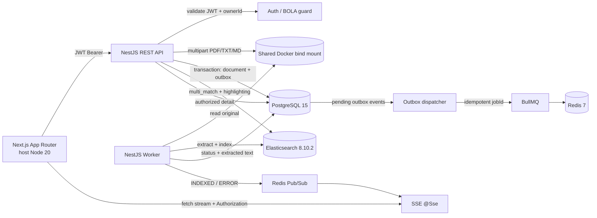

# Arquitectura del sistema

## Contexto

Atlas permite autenticar un usuario demo, subir documentos PDF/TXT/Markdown, procesarlos de forma asíncrona, buscar por texto completo y leer el contenido extraído. El estado transaccional vive en PostgreSQL; Elasticsearch es una proyección de lectura eventual. El navegador recibe progreso por SSE y nunca consulta el estado en bucle.

## Componentes y flujo

## Stack y límites

- **Monorepo npm:** `backend/`, `frontend/`, `packages/shared/` y `docs/`. Los tipos compartidos describen estados y contratos públicos, no entidades ORM.
- **Backend NestJS 10 / TypeScript estricto:** el dominio define el registro documental, la aplicación expone puertos y los adaptadores de infraestructura usan TypeORM, BullMQ, filesystem, Elasticsearch y Redis.
- **Frontend Next.js 15 App Router:** UI de acceso, carga individual/múltiple, búsqueda paginada, seguimiento SSE y detalle Markdown. ReactMarkdown no habilita HTML sin procesar; los fragmentos `mark` se convierten a nodos React, nunca a `dangerouslySetInnerHTML`.
- **PostgreSQL 15 + TypeORM:** fuente de verdad para propietario, metadatos, estado y texto extraído. En Compose se usa `synchronize` para demo; una instalación productiva requiere migraciones versionadas y `synchronize=false`.
- **Elasticsearch 8.10.2:** índice invertido para `multi_match`, filtros por `ownerId`, orden por relevancia y fecha, paginación `offset/limit` limitada a 50 resultados y highlighting de contenido/título. No se usa SQL `LIKE`.
- **Redis 7:** BullMQ mantiene trabajos y reintentos; Pub/Sub propaga cambios SSE entre procesos. Pub/Sub no es durable; SSE lee estado persistido al conectar y luego escucha eventos. Si Redis Pub/Sub falla durante una conexión activa, el navegador no inicia polling automático.
- Si el stream se interrumpe antes del estado terminal, el cliente vuelve a conectarse con backoff exponencial acotado y abortable; cada conexión vuelve a leer el estado persistido, sin consultas periódicas.
- **Archivos:** UUID aleatorio y volumen compartido API/worker local. Es una solución de demostración en un host; réplicas sobre nodos distintos requieren object storage compartido.

## Endpoints

| Método | Ruta | Descripción |
| --- | --- | --- |
| `POST` | `/api/auth/login` | Emite JWT de 15 minutos para credenciales demo del entorno. |
| `POST` | `/api/documents` | Recibe un documento multipart y responde `202` con ID y `PROCESSING`. |
| `GET` | `/api/documents/:id` | Devuelve metadatos/contenido extraído solo al propietario. |
| `GET` | `/api/documents/:id/status/stream` | Emite estado inicial y terminal mediante SSE autenticado. |
| `GET` | `/api/search?q=&offset=0&limit=20` | Busca por texto con filtro de propietario, páginas acotadas y highlights. |
| `GET` | `/api/health` | Health probe del proceso API. |

La UI acepta selección múltiple y crea una solicitud independiente por archivo para que cada documento tenga transacción, UUID y stream de seguimiento propios.

## Seguridad

- El JWT se envía como Bearer en `Authorization`; el frontend no lo guarda en `localStorage` ni lo coloca en la URL. Para SSE usa `fetch` con `ReadableStream`, porque `EventSource` no permite cabeceras personalizadas.
- `ownerId` proviene del claim `sub`. Dos identidades demo configurables permiten verificar que consultas de detalle y búsqueda filtran por propietario; JWT sin estas comprobaciones no mitigaría BOLA.
- PDFs se reconocen por firma `%PDF-`, no por MIME o nombre. TXT/Markdown requieren allowlist de extensión, UTF-8 válido y ausencia de bytes nulos. El tamaño máximo por archivo es configurable (10 MiB por defecto). Magic Bytes no es análisis antimalware.
- Elasticsearch se configura sin seguridad solo en Compose local, con puertos enlazados a loopback. No reutilizar credenciales, secretos ni configuración de red local en producción.
- Node 20 se mantiene por la instrucción de la prueba, aunque llegó a fin de soporte el 30 de abril de 2026. Elegir una línea soportada (Node 22/24) antes de desplegar.

## Consistencia y escalado

La recepción escribe el documento y el evento Outbox en la misma transacción. Un dispatcher reintentable crea un job BullMQ con ID determinista; un reintento no debería generar una segunda identidad documental. El worker extrae, indexa con ID estable, persiste el texto/estado y emite el resultado. PostgreSQL y Elasticsearch pueden divergir ante fallos parciales; las operaciones se hacen idempotentes, pero una operación real necesita cola de fallos, métricas y reconciliación periódica.

Los workers se escalan aumentando concurrencia/réplicas y limitando el ritmo frente a Elasticsearch. La búsqueda no escanea PostgreSQL y usa límite de página y offset máximo. Para páginas profundas conviene `search_after`. El almacenamiento filesystem y el usuario demo son límites deliberados de la prueba, no un diseño bancario de producción. La latencia debe medirse con volumen, carga y hardware documentados; no puede garantizarse un rango fijo sin ese contexto.

## Ejecución local

NVM activa Node 20 en el host para Next.js. Docker Compose ejecuta PostgreSQL, Elasticsearch, Redis, API y worker; API y worker comparten `./storage`. Los comandos de arranque están en el README de raíz.